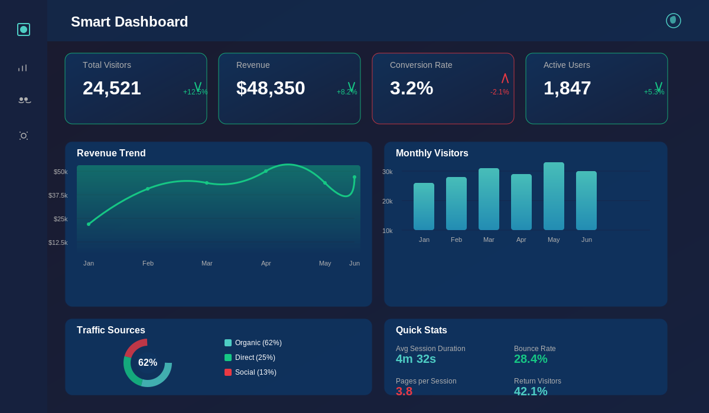

# 📊 Smart Dashboard

<div align="center">

[](https://reactjs.org/)
[](https://nodejs.org/)
[](https://www.chartjs.org/)
[](https://expressjs.com/)
[](https://developer.mozilla.org/en-US/docs/Web/JavaScript)
[](LICENSE)

**A real-time analytics dashboard built with React, Chart.js & Node.js**

Live weather, stocks, and news in one sleek, responsive UI.

[View Demo](#) • [Report Bug](#) • [Request Feature](#)

</div>

---

## 📸 Preview

<div align="center">

</div>

---

## ✨ Features

| Feature | Description |
|---------|-------------|
| 🌤️ **Live Weather Data** | Real-time weather updates with automatic location detection |
| 📈 **Stock Market Tracker** | Live stock prices and market trends at a glance |
| 📰 **News Aggregator** | Curated news headlines from multiple sources |
| 🎨 **Dark/Light Theme** | Seamless theme toggle for comfortable viewing |
| 📱 **Responsive Design** | Works flawlessly on mobile, tablet, and desktop |
| 📊 **Interactive Charts** | Beautiful, animated charts powered by Chart.js |
| ⚡ **Real-Time Updates** | WebSocket integration for live data streaming |
| 🔐 **Secure APIs** | Encrypted API calls with rate limiting |

---

## 🛠️ Tech Stack

### Frontend
-  **React** - UI Framework
-  **Chart.js** - Data Visualization
-  **Tailwind CSS** - Styling

### Backend
-  **Node.js** - Runtime
-  **Express.js** - Web Framework

### APIs & Services
- 🌐 **OpenWeatherMap** - Weather data
- 📊 **Alpha Vantage** - Stock market data
- 📰 **NewsAPI** - News aggregation

### Deployment
-  **Docker** - Containerization
-  **Vercel** - Hosting

---

## 📊 Dashboard Preview

The Smart Dashboard provides a modern, unified interface for monitoring real-time data across multiple sources:

```
┌─────────────────────────────────────────────────────────────┐
│  📊 SMART DASHBOARD                                    ☀️/🌙 │
├─────────────────────────────────────────────────────────────┤
│                                                              │
│  🌤️ WEATHER              📈 STOCKS          📰 HEADLINES    │
│  ┌──────────────────┐  ┌──────────────┐  ┌──────────────┐  │
│  │ Temp: 72°F      │  │ AAPL: $180   │  │ Market surge │  │
│  │ Humidity: 65%   │  │ MSFT: $340   │  │ New tech    │  │
│  │ Wind: 12 mph    │  │ GOOGL: $125  │  │ AI advances │  │
│  │ Clear, Sunny ☀️ │  │ +2.5% today  │  │ Updates... │  │
│  └──────────────────┘  └──────────────┘  └──────────────┘  │
│                                                              │
│  📊 INTERACTIVE ANALYTICS                                   │
│  ┌──────────────────────────────────────────────────────┐  │
│  │                   Chart.js Visualization              │  │
│  │  ▁ ▂ ▃ ▄ ▅ ▆ ▇ █ ▇ ▆ ▅ ▄ ▃ ▂ ▁ Real-time updates  │  │
│  │  Stock prices, trends, and KPI analytics            │  │
│  └──────────────────────────────────────────────────────┘  │
│                                                              │
└─────────────────────────────────────────────────────────────┘
```

**Features Include:**
- Live weather data with location detection
- Real-time stock market tracking
- Curated news aggregation
- Dark & Light mode toggle
- Fully responsive design
- Beautiful animated charts

---

## 📁 Project Structure

```
smart-dashboard/
├── src/
│   ├── components/
│   │   ├── Dashboard.jsx
│   │   ├── Chart.jsx
│   │   ├── Weather.jsx
│   │   ├── StockTracker.jsx
│   │   └── NewsCard.jsx
│   ├── pages/
│   │   ├── Home.jsx
│   │   └── Settings.jsx
│   ├── hooks/
│   │   ├── useWeather.js
│   │   ├── useStocks.js
│   │   └── useNews.js
│   ├── styles/
│   │   └── globals.css
│   ├── App.jsx
│   └── index.js
├── server/
│   ├── routes/
│   │   ├── weather.js
│   │   ├── stocks.js
│   │   └── news.js
│   ├── controllers/
│   │   └── dashboardController.js
│   ├── middleware/
│   │   └── auth.js
│   └── server.js
├── public/
├── .env.example
├── package.json
└── README.md
```

---

## 🚀 Quick Start

### Prerequisites
- Node.js (v16 or higher)
- npm or yarn
- API Keys for:
  - [OpenWeatherMap](https://openweathermap.org/api)
  - [Alpha Vantage](https://www.alphavantage.co/)
  - [NewsAPI](https://newsapi.org/)

### Installation

1. **Clone the repository**
```bash
git clone https://github.com/razinahmed/smart-dashboard.git
cd smart-dashboard
```

2. **Install dependencies**
```bash
npm install
```

3. **Set up environment variables**
```bash
cp .env.example .env
```
Then add your API keys to `.env`:
```env
REACT_APP_WEATHER_API_KEY=your_openweathermap_key
REACT_APP_STOCK_API_KEY=your_alphavantage_key
REACT_APP_NEWS_API_KEY=your_newsapi_key
```

4. **Start the development server**
```bash
npm run dev
```

5. **Open in browser**
```
http://localhost:3000
```

### Docker Setup

```bash
docker build -t smart-dashboard .
docker run -p 3000:3000 smart-dashboard
```

---

## 📡 API Endpoints

| Method | Endpoint | Description |
|--------|----------|-------------|
| `GET` | `/api/weather` | Get current weather data |
| `GET` | `/api/weather/:location` | Get weather for specific location |
| `GET` | `/api/stocks` | Get trending stocks |
| `GET` | `/api/stocks/:symbol` | Get specific stock data |
| `GET` | `/api/news` | Get latest news |
| `GET` | `/api/news/:category` | Get news by category |
| `POST` | `/api/dashboard/save` | Save dashboard preferences |
| `GET` | `/api/dashboard/config` | Get dashboard configuration |

---

## 🔧 Development

### Available Scripts

```bash
# Start development server
npm run dev

# Build for production
npm run build

# Run tests
npm test

# Run linter
npm run lint

# Format code
npm run format
```

### Contributing

We welcome contributions! Please follow these steps:

1. **Fork the repository**
   ```bash
   git clone https://github.com/yourusername/smart-dashboard.git
   ```

2. **Create a feature branch**
   ```bash
   git checkout -b feature/amazing-feature
   ```

3. **Commit your changes**
   ```bash
   git commit -m 'Add amazing feature'
   ```

4. **Push to your branch**
   ```bash
   git push origin feature/amazing-feature
   ```

5. **Open a Pull Request**
   - Describe your changes clearly
   - Link any related issues
   - Ensure all tests pass

### Code Standards
- Follow ESLint configuration
- Write meaningful commit messages
- Add tests for new features
- Update documentation as needed

---

## 📝 License

This project is licensed under the **MIT License** - see the [LICENSE](LICENSE) file for details.

```
MIT License

Copyright (c) 2024 Abdul Rasak V

Permission is hereby granted, free of charge, to any person obtaining a copy
of this software and associated documentation files (the "Software"), to deal
in the Software without restriction, including without limitation the rights
to use, copy, modify, merge, publish, distribute, sublicense, and/or sell
copies of the Software, and to permit persons to whom the Software is
furnished to do so, subject to the following conditions:

The above copyright notice and this permission notice shall be included in all
copies or substantial portions of the Software.
```

---

## 🤝 Support & Contact

- 🐛 Found a bug? [Open an issue](https://github.com/razinahmed/smart-dashboard/issues)
- 💡 Have a feature request? [Let us know](https://github.com/razinahmed/smart-dashboard/issues)
- 📧 Email: contact@example.com
- 🐙 GitHub: [@razinahmed](https://github.com/razinahmed)

---

<div align="center">

### Made with ❤️ by [Abdul Rasak V](https://github.com/razinahmed)

⭐ If this project helped you, please give it a star!


</div>

